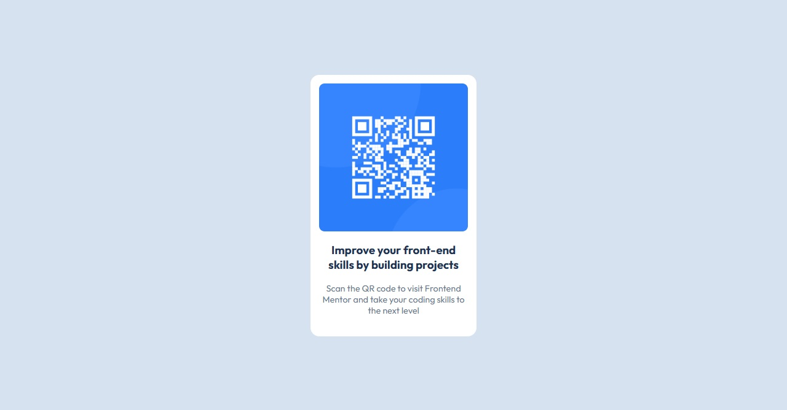

# Frontend Mentor - QR Code Component Solution

This is my solution to the QR Code Component challenge on Frontend Mentor. The goal of this project was to recreate the provided design using semantic HTML and CSS.

## Overview

### Screenshot

### Links

- Solution URL: https://github.com/eduardoseq17/QrCodeComponent.github.io
- Live Site URL: https://eduardoseq17.github.io/QrCodeComponent.github.io/

## Built with

- Semantic HTML5
- CSS Custom Properties
- Flexbox
- Mobile-first workflow

## What I learned

While building this project, I practiced:

- Writing semantic HTML using `<main>` and `<article>`.
- Structuring cleaner CSS.
- Using CSS custom properties (variables).
- Centering elements with Flexbox.
- Organizing CSS properties for better readability.

## Continued development

In future projects I want to improve my:

- Responsive design skills.
- CSS organization.
- Accessibility knowledge.
- JavaScript fundamentals.

## AI Collaboration

I used ChatGPT to review my HTML and CSS, receive feedback on code organization, and learn Git and GitHub best practices.

## Author

- GitHub - https://github.com/eduardoseq17
- Frontend Mentor - https://www.frontendmentor.io/profile/eduardoseq17
